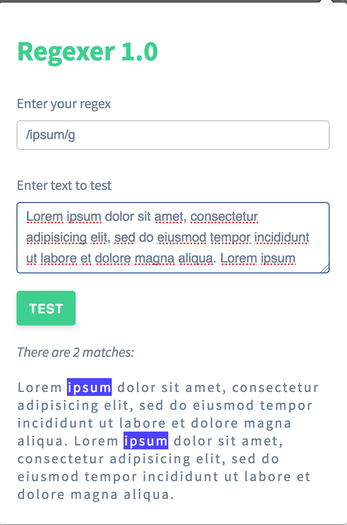
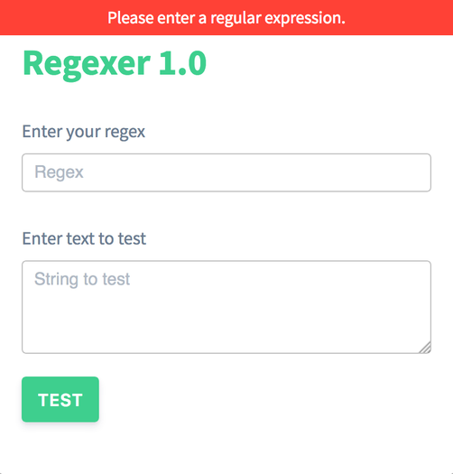
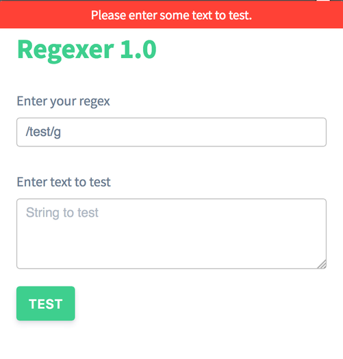

# regexer 

Web extension for Firefox to quickly check matches in a string against a regular expression.

## Install

[Regexer on Firefox Add-ons Store](https://addons.mozilla.org/en-US/firefox/addon/regexer/)

[Find and install add-ons to add features to Firefox](https://support.mozilla.org/en-US/kb/find-and-install-add-ons-add-features-to-firefox)

Click on `Add to Firefox` to install this web extension.

## Browser/OS target

This addon is supposed to run fine on all major OS platforms and targets `Firefox >= 55.0`

## Screenshots

### Regex search


### Empty regex error


### Empty text error


## Test

```bash
$ npm test
```

## Issues

Please mention Firefox and OS version while creating an issue.
